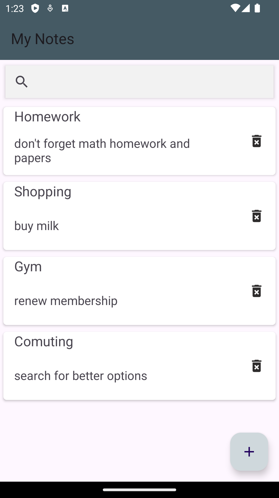
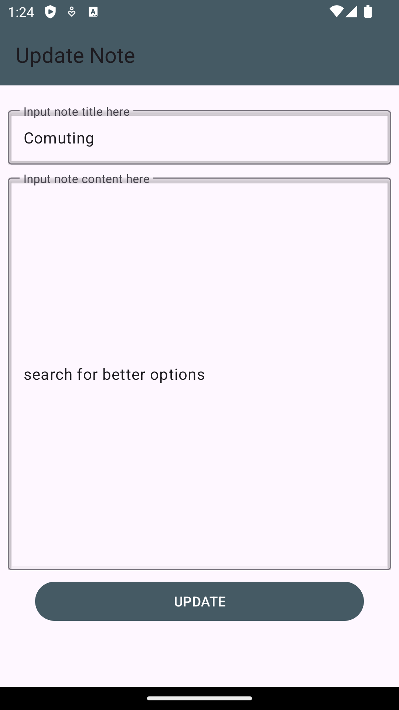
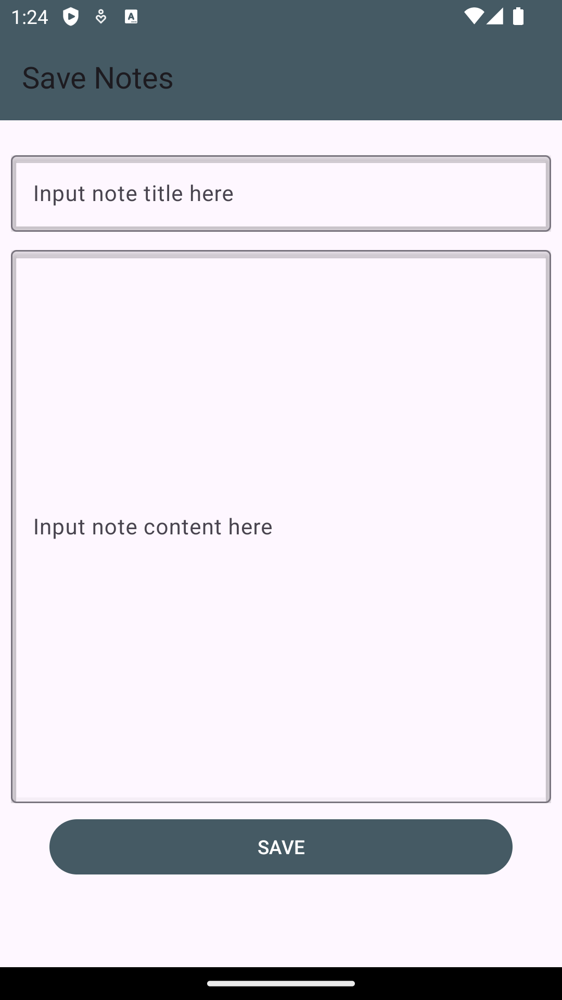

# Notes App

NotesApp is a simple Android application for managing your notes. It allows you to create, edit, delete, and search notes easily.

NotesApp is a mobile application developed by using Kotlin for Android devices. 

It utilizes the Room database for data persistence and follows the MVVM architecture pattern. 

The app enables users to manage their notes efficiently.

## Screenshots

<table>
  <tr>
    <td></td>
    <td></td>
    <td></td>
  </tr>
</table>

## Features

**Create Notes:** Easily create new notes with a title and content.

**Edit Notes:** Update existing notes with new information.

**Delete Notes:** Remove unwanted notes from the application.

**Search Notes:** Quickly find specific notes using the search functionality.

## Technologies Used

**Kotlin:** Used in conjunction with Java for enhanced functionality.

**Room Database:** A SQLite object mapping library to provide local data persistence.

**Dagger Hilt:** Dependency injection framework for Android.

**ViewModel and LiveData:** Components of the Android Architecture Components used to manage UI-related data.

## Usage

**Home Screen:**

View a list of your notes.

Use the search bar to filter notes based on content.

**Details Screen:**

Tap on a note to view or edit its details.

**Save Screen:**

Add a new note by providing a title and content.

## Contributing

If you wish to contribute to this project, you can follow these steps:

Fork this repository.

Add new features or fixes.

Submit your changes as a pull request.

## Developer

This application was developed by Ozan YİĞİT.
# Note-App
